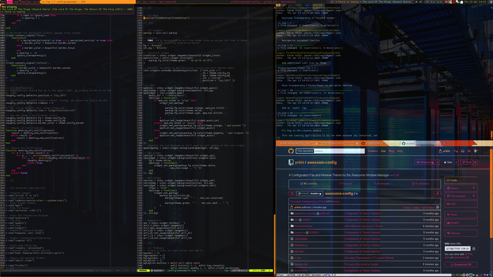

AwesomeWM Configuration
========================

This an set of configuration files for the [Awesome Window Manager][awesome].
It ends up looking like this:

To install:

    cd ~/.config
    git clone https://github.com/prikhi/awesome-config awesome

[awesome]: http://awesome.naquadah.org/
